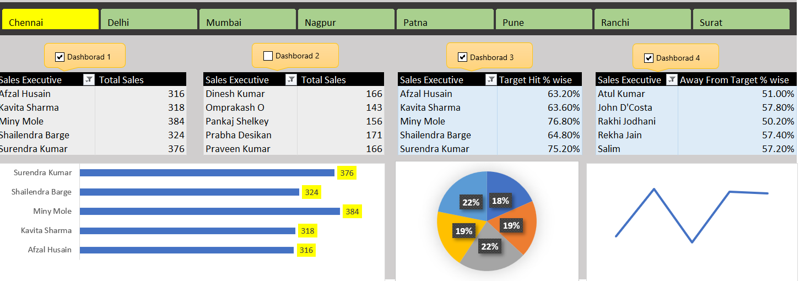

# Sales Performance Analysis & Excel Dashboard

## 📌 Project Overview

This project analyzes sales performance data of sales executives across multiple regions and days.

The objective is to transform raw sales data into meaningful performance insights using Microsoft Excel and an interactive dashboard.

The dashboard helps compare sales executives, track total sales, measure target achievement, and analyze regional performance.

---

## 🎯 Business Objectives

- Analyze sales performance of individual sales executives
- Compare sales across different regions
- Track total sales achieved by each executive
- Measure target achievement percentage
- Identify high-performing and low-performing sales executives
- Analyze day-wise sales performance
- Provide an interactive dashboard for business reporting

---

## 🛠️ Tools & Technologies

- Microsoft Excel
- Excel Formulas
- Pivot Tables
- Pivot Charts
- Data Filtering
- Data Analysis
- Dashboard Development

---

## 📊 Dataset

The raw dataset contains sales information including:

- Employee Code
- Sales Executive
- Region
- Day 1 Sales
- Day 2 Sales
- Day 3 Sales
- Day 4 Sales
- Day 5 Sales
- Total Sales
- Sales Target
- Target Hit Percentage

---

## 🔍 Analysis Performed

### 1. Sales Executive Performance
Analyzed total sales achieved by individual sales executives.

### 2. Regional Analysis
Compared sales performance across different regions.

### 3. Target Achievement
Calculated and analyzed the percentage of target achieved by each sales executive.

### 4. Day-wise Sales Analysis
Analyzed sales performance across Day 1 to Day 5.

### 5. Performance Comparison
Compared executives based on total sales and target achievement.

---

## 📈 Excel Dashboard

The interactive dashboard includes:

- Regional filters
- Sales Executive performance tables
- Total Sales analysis
- Target Hit % analysis
- Executive-wise sales comparison
- Charts for performance visualization
- Multiple dashboard views

---

## 💡 Key Insights

The dashboard can be used to:

- Identify sales executives with higher sales performance
- Identify executives who are closer to or farther from their sales targets
- Compare sales performance between regions
- Understand variations in daily sales
- Support sales performance monitoring and reporting

---

## 📁 Project Files

- `Sales-Performance-Analysis.xlsx` — Complete Excel analysis and dashboard
- `Sales-Performance-Dashboard.png` — Dashboard preview
- `README.md` — Project documentation

---

## 🚀 Conclusion

This project demonstrates practical skills in Excel-based data analysis, performance tracking, data visualization, and dashboard development.

It can be used as a portfolio project to demonstrate data analyst skills in Excel and business performance reporting.
